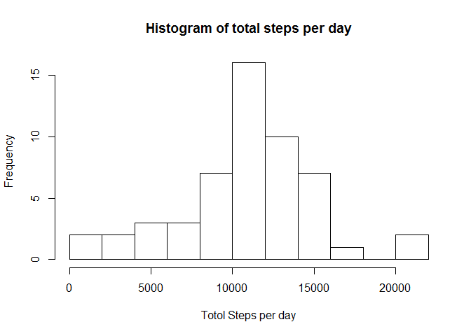
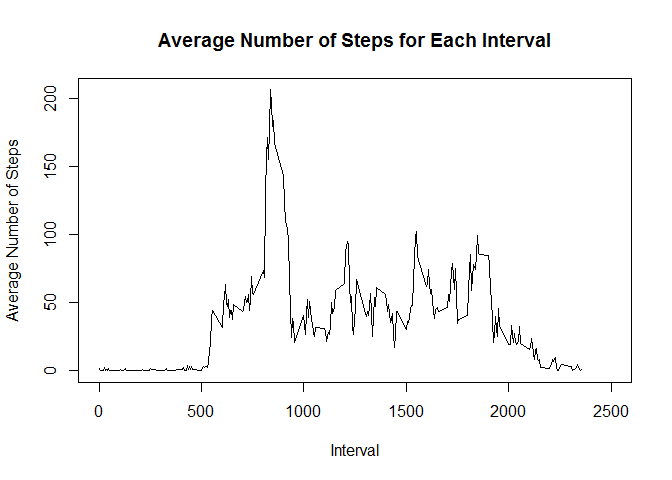
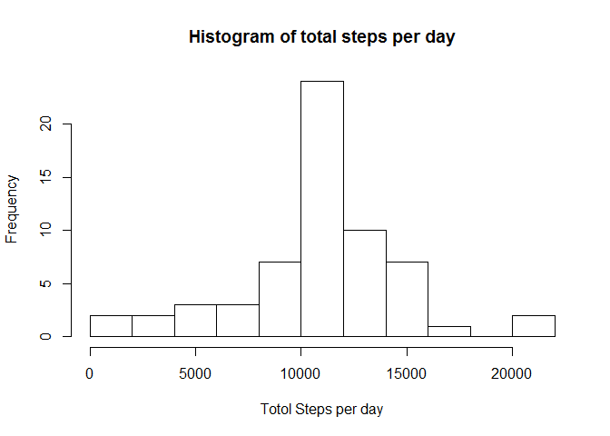
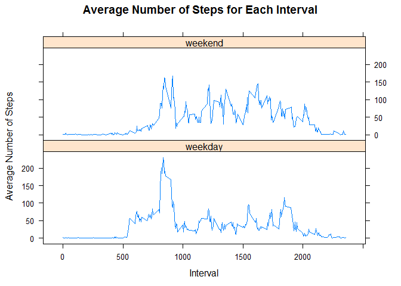

#Loading and Pre processing the data

The first step is to read the source data using the read.csv function. This is assuming the source file is present
in the current working directory


```r
activity<-read.csv("activity.csv")
```

#What is mean total number of steps taken per day?

Calculate total number of steps taken each day using the aggreagte function of dplyr package


```r
tot_steps<-aggregate(activity$steps,list(activity$date),sum)
colnames(tot_steps)<-c("Date","Total_Steps")
```

Create a histogram of the total steps per day using the hist function


```r
hist(tot_steps$Total_Steps,xlab="Totol Steps per day",main="Histogram of total steps per day",breaks=10)
```

<!-- -->

Mean for total number of steps per day:


```r
mean(tot_steps$Total_Steps,na.rm = TRUE)
```

```
## [1] 10766.19
```

Median for total number of steps per day:


```r
median(tot_steps$Total_Steps,na.rm = TRUE)
```

```
## [1] 10765
```

#What is the average daily activity pattern?

Caluclate mean numbers of steps for each interval across days


```r
avg_steps<-aggregate(activity$steps,list(activity$interval),mean,na.rm=TRUE)
colnames(avg_steps)<-c("Interval","Avg_Steps")
```

Plot time series-graph for average number of steps


```r
plot(avg_steps$Interval,avg_steps$Avg_Steps,type = "l",xlab = "Interval",ylab="Average Number of Steps",main="Average Number of Steps for Each Interval",xlim=c(0,2500))
```

<!-- -->

5-minute interval, on average across all the days in the dataset, containing the maximum number of steps:


```r
avg_steps[which.max(avg_steps[,2]),1]
```

```
## [1] 835
```


#Imputing missing values

Total number of missing values in the dataset: 


```r
sum(is.na(activity$steps))
```

```
## [1] 2304
```

#Impute missing values with the avergae number of steps in that particular interval


```r
library(dplyr)
```

```
## Warning: package 'dplyr' was built under R version 3.3.3
```

```
## 
## Attaching package: 'dplyr'
```

```
## The following objects are masked from 'package:stats':
## 
##     filter, lag
```

```
## The following objects are masked from 'package:base':
## 
##     intersect, setdiff, setequal, union
```

```r
activity_fill<-activity %>% group_by(interval) %>% mutate_at(vars(steps),funs(replace(steps,which(is.na(steps)),mean(steps,na.rm = TRUE))))
```

```
## Warning: package 'bindrcpp' was built under R version 3.3.3
```

Histogram of total number of steps each day post imputation.


```r
tot_steps_filled<-aggregate(activity_fill$steps,list(activity_fill$date),sum)
colnames(tot_steps_filled)<-c("Date","Total_Steps")
```

Create a histogram of the total steps per day using the hist function


```r
hist(tot_steps_filled$Total_Steps,xlab="Totol Steps per day",main="Histogram of total steps per day",breaks=10)
```

<!-- -->

Mean for total number of steps per day:


```r
mean(tot_steps_filled$Total_Steps,na.rm = TRUE)
```

```
## [1] 10766.19
```

Median for total number of steps per day:


```r
median(tot_steps_filled$Total_Steps,na.rm = TRUE)
```

```
## [1] 10766.19
```

Difference between mean of imputed data and non imputed data:

```r
mean(tot_steps_filled$Total_Steps)-mean(tot_steps$Total_Steps,na.rm = TRUE)
```

```
## [1] 0
```

Difference between median of imputed data and non imputed data:

```r
median(tot_steps_filled$Total_Steps)-median(tot_steps$Total_Steps,na.rm = TRUE)
```

```
## [1] 1.188679
```

There is no difference in the mean values of imputed and non imputed data. Median does
show slight difference.

#Are there differences in activity patterns between weekdays and weekends?

Add a factor variable for weekend and weekday


```r
activity_fill$Day_Type<-weekdays(as.Date(activity_fill$date))
activity_fill$Day_Type[activity_fill$Day_Type %in% c("Saturday","Sunday")]<-"weekend"
activity_fill$Day_Type[!activity_fill$Day_Type %in% "weekend"]<-"weekday"
```


Caluclate mean numbers of steps for each interval across weekday and weekend


```r
avg_steps_daytype<-aggregate(activity_fill$steps,list(activity_fill$Day_Type,activity_fill$interval),mean)
colnames(avg_steps_daytype)<-c("Day_Type","Interval","Avg_Steps")
```

Plot time series-graph for average number of steps


```r
library(lattice)
xyplot(avg_steps_daytype$Avg_Steps~avg_steps_daytype$Interval|avg_steps_daytype$Day_Type,xlab = "Interval",ylab="Average Number of Steps",main="Average Number of Steps for Each Interval",layout=(c(1,2)),type="l")
```

<!-- -->
